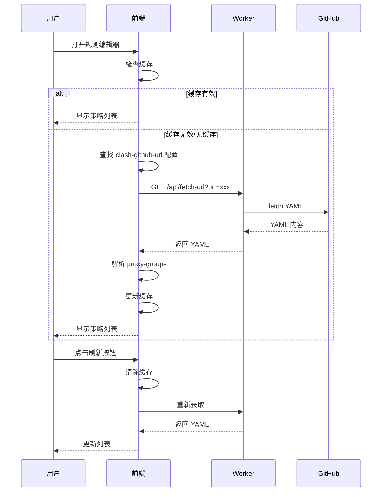
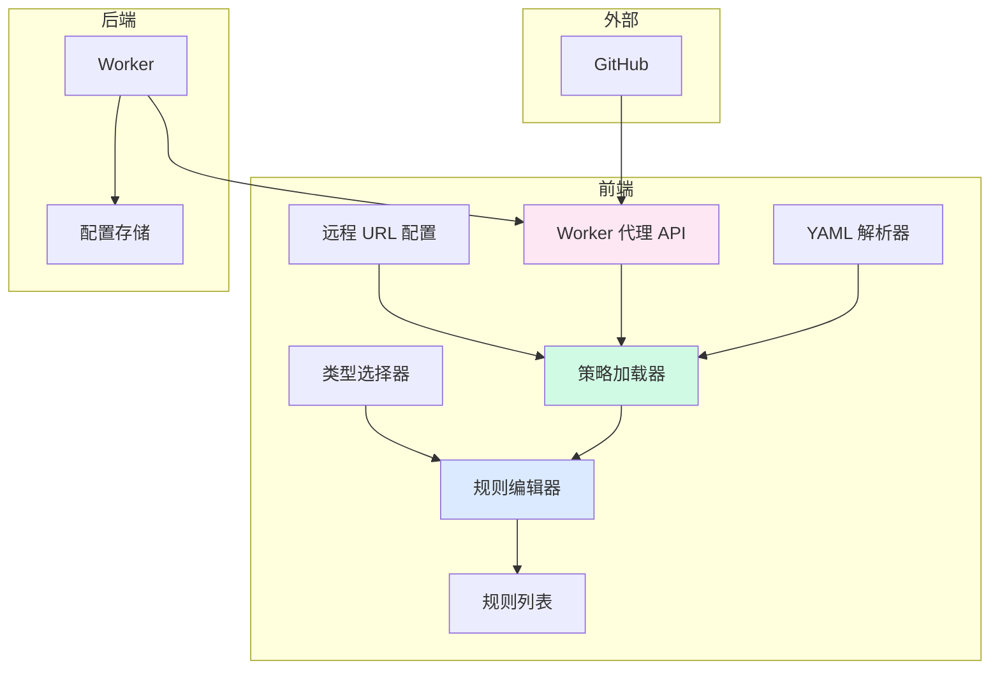

# 配置中心功能增强规划 (v1.1)

> 规划版本: v1.1 (迭代版本)
> 创建时间: 2025-12-29
> 上次版本: v1.0
> 状态: 待评审
> 更新内容: 新增动态代理策略配置功能

---

## 📋 更新摘要

**v1.1 新增内容**:
- ✨ 新增 `clash-github-url` 配置类型
- ✨ 支持从远程 URL 动态读取代理策略
- ✨ Worker 代理 API 解决跨域问题
- ✨ 策略缓存机���减少请求

---

## 一、需求概述

### 1.1 核心目标
为配置中心添加**配置类型系统**、**动态代理策略**和**UI 美化升级**，提升用户体验和操作效率。

### 1.2 功能需求

#### A. 配置类型支持
- 引入"配置类型"概念，支持不同格式的专门化处理
- 支持的类型：
  - `common`: 通用文本/JSON 配置（默认类型）
  - `clash-yml`: Clash 配置规则的专用编辑器
  - `clash-github-url`: Clash 远程配置链接（新增）
  - `json`: JSON 配置（未来扩展）
- 为每种类型提供专门的 UI 和操作方式

#### B. Clash YAML 规则编辑器
- 可视化规则添加界面
- 支持的规则类型：DOMAIN、DOMAIN-SUFFIX、IP-CIDR、GEOIP 等
- **动态代理策略选择** - 从 `clash-github-url` 配置中读取 proxy-groups（新增）
- 规则列表的可视化展示与管理

#### C. 动态代理策��配置（新增）
- 支持从远程 GitHub URL 读取 Clash 配置
- 自动解析 `proxy-groups` 并提取策略名称
- 策略列表缓存与刷新
- Worker 代理解决 CORS 问题

#### D. UI 美化与移动端适配
- 现代化设计风格
- 完整的移动端响应式支持
- 改进的色彩系统和排版

---

## 二、功能分解

### 2.1 类型系统实现

#### 任务 2.1.1: 数据结构扩展
**优先级**: 🔴 高

**当前结构**:
```json
{
  "value": "配置值",
  "comment": "配置说明"
}
```

**扩展后结构**:
```json
{
  "value": "配置值或结构化数据",
  "comment": "配置说明",
  "type": "clash-yml | clash-github-url | common | json",
  "metadata": {
    "version": "1.0",
    "lastModified": "2025-12-29",
    "cachedPolicies": ["Proxy", "Direct", "Reject"], // 缓存的策略
    "cacheTime": "2025-12-29T16:32:00Z"
  }
}
```

**实施步骤**:
1. 更新前端数据模型
2. 更新后端验证逻辑（保持向后兼容）
3. 添加类型迁移脚本（可选）

**验收标准**:
- [ ] 新配置可以指定类型
- [ ] 旧配置默认为 `common` 类型
- [ ] API 读取时包含类型信息

---

#### 任务 2.1.2: 类型选择器 UI
**优先级**: 🔴 高

**位置**: 配置表单（新增/编辑）

**设计方案**:
```
┌─────────────────────────────────────┐
│ 配置类型:                           │
│ ○ 通用配置 (common)                 │
│ ○ Clash YAML 规则 (clash-yml)       │
│ ○ Clash 远程链接 (clash-github-url) │
│ ○ JSON 配置 (json)                  │
└─────────────────────────────────────┘
```

**交互行为**:
- 选择不同类型时，表单动态调整
- `common`: 显示传统文本框
- `clash-yml`: 显示规则编辑器
- `clash-github-url`: 显示 URL 输入框 + 测试连接按钮

**验收标准**:
- [ ] 新增配置时可选择类型
- [ ] 类型切换时表单正确响应
- [ ] 默认类型为 `common`

---

### 2.2 Clash YAML 规则编辑器

#### 任务 2.2.1: 规则数据结构设计
**优先级**: 🔴 高

**单条规则结构**:
```yaml
# Clash 规则格式
- RULE-TYPE,RULE-VALUE,POLICY-GROUP
```

**示例**:
```yaml
- DOMAIN-SUFFIX,google.com,Proxy
- IP-CIDR,192.168.1.0/24,DIRECT
```

**存储格式** (在 KV 中):
```json
{
  "type": "clash-yml",
  "value": {
    "rules": [
      {
        "type": "DOMAIN-SUFFIX",
        "value": "google.com",
        "policy": "Proxy",
        "enabled": true
      },
      {
        "type": "IP-CIDR",
        "value": "192.168.1.0/24",
        "policy": "DIRECT",
        "enabled": true
      }
    ]
  },
  "comment": "Clash 规则配置"
}
```

**验收标准**:
- [ ] 数据结构支持规则的增删改查
- [ ] 支持规则启用/禁用状态
- [ ] 保留策略组列表供快速选择

---

#### 任务 2.2.2: 可视化规则编辑器（更新）
**优先级**: 🔴 高

**UI 设计**:
```
┌──────────────────────────────────────────────┐
│ 🎯 Clash 规则快速添加                         │
├──────────────────────────────────────────────┤
│ 规则类型:  [DOMAIN-SUFFIX ▼]                │
│                                              │
│ 规则内容:  [_____________________________]  │
│           (如: google.com)                   │
│                                              │
│ 代理策略:  [Proxy             ▼]            │
│           🔄 从远程配置刷新                   │
│           (可选: Direct, Reject, Proxy)      │
│                                              │
│           [+ 添加规则]                       │
└──────────────────────────────────────────────┘
```

**代理策略下拉框行为**:
1. 默认显示常用策略：`Proxy`, `Direct`, `Reject`
2. 自动从 `clash-github-url` 类型配置中读取
3. 显示加载状态："正在加载策略..."
4. 加载失败时显示错误提示
5. 提供手动刷新按钮

**支持的规则类型**:
- `DOMAIN`: 精确域名匹配
- `DOMAIN-SUFFIX`: 域名后缀匹配
- `DOMAIN-KEYWORD`: 域名关键字匹配
- `IP-CIDR`: IP 段匹配
- `GEOIP`: 国家代码匹配
- `SRC-IP-CIDR`: 源 IP 匹配

**验收标准**:
- [ ] 可视化添加单条规则
- [ ] 下拉选择规则类型和策略
- [ ] 策略列表支持动态加载
- [ ] 实时验证规则格式
- [ ] 支持规则的启用/禁用

---

#### 任务 2.2.3: 规则列表展示
**优先级**: 🟡 中

**列表 UI**:
```
┌──────────────────────────────────────────────────┐
│ 📋 Clash 规则列表 (共 5 条)                       │
├──────────────────────────────────────────────────┤
│ ✅ DOMAIN-SUFFIX  google.com       →  Proxy     │
│ ✅ IP-CIDR       192.168.1.0/24    →  Direct    │
│ ⭕ DOMAIN        example.com       →  Reject    │
│                                                  │
│ [导出 YAML] [批量导入]                           │
└──────────────────────────────────────────────────┘
```

**功能**:
- 规则类型图标/标签（不同类型不同颜色）
- 策略组标签显示
- 单规则操作：编辑、删除、切换启用状态
- 拖拽排序（可选）
- 导出为标准 YAML 格式

**验收标准**:
- [ ] 规则按类型分组展示
- [ ] 支持单规则的启用/禁用
- [ ] 支持规则的编辑和删除
- [ ] 可导出为 Clash 兼容的 YAML

---

#### 任务 2.2.4: YAML 解析与生成
**优先级**: 🟡 中

**功能需求**:
- 将规则列表转换为 Clash 兼容的 YAML 格式
- 解析现有 YAML 并导入规则列表
- 处理转义字符和特殊字符

**技术方案**:
```javascript
// 伪代码
function rulesToYAML(rules) {
  return rules
    .filter(r => r.enabled)
    .map(r => `  - ${r.type},${r.value},${r.policy}`)
    .join('\n');
}

function yamlToRules(yamlText) {
  // 解析 YAML 规则
  // 返回规则数组
}
```

**验收标准**:
- [ ] 规则列表可转换为标准 YAML
- [ ] 可导入现有 YAML 配置
- [ ] 正确处理特殊字符

---

### 2.3 动态代理策略配置（新增）

#### 任务 2.3.1: clash-github-url 配置类型
**优先级**: 🔴 高

**功能描述**:
支持创建 `clash-github-url` 类型的配置，存储远程 Clash 配置文件的 URL。

**数据结构**:
```json
{
  "key": "my-clash-config",
  "value": "https://raw.githubusercontent.com/example/clash/main/config.yaml",
  "comment": "我的 Clash 配置链接",
  "type": "clash-github-url",
  "metadata": {
    "lastSync": "2025-12-29T16:32:00Z",
    "status": "active"
  }
}
```

**UI 设计**:
```
┌─────────────────────────────────────┐
│ 配置类型: ○ Clash 远程链接          │
├─────────────────────────────────────┤
│ 配置键:   [my-clash-config______]  │
│                                     │
│ 配置链接: [https://github.com/...] │
│           [测试连接]                │
│                                     │
│ 注释:     [我的 Clash 配置______]  │
│                                     │
│           [保存]                    │
└─────────────────────────────────────┘
```

**验收标准**:
- [ ] 可创建 clash-github-url 类型配置
- [ ] URL 输入框支持长链接
- [ ] 提供"测试连接"功能
- [ ] 保存后可正常读取

---

#### 任务 2.3.2: Worker 代理 API（新增）
**优先级**: 🔴 高

**功能描述**:
在 Cloudflare Worker 中添加代理 API，解决前端直接请求远程 URL 的 CORS 问题。

**安全要求**: 🔴 **必须认证**
- 所有请求必须携带有效的 Bearer Token
- 与其他 API 保持一致的安全标准
- 防止未授权用户滥用代理功能

**API 端点**:
```
GET /api/fetch-url?url={encoded_url}
Headers: Authorization: Bearer {AUTH_TOKEN}
```

**Worker 代码实现**:
```javascript
// 在 worker.js 中添加
async function handleFetchUrl(request, env) {
  const url = new URL(request.url);
  const requestOrigin = request.headers.get('Origin');
  const targetUrl = url.searchParams.get('url');

  // 参数验证
  if (!targetUrl) {
    return createResponse(requestOrigin, 'Missing URL parameter', 400);
  }

  // URL 白名单验证（推荐）
  const allowedDomains = [
    'raw.githubusercontent.com',
    'github.com',
    'gitlab.com',
    'raw.githubusercontent.com.cn',
    'ghproxy.com'
  ];

  let parsedUrl;
  try {
    parsedUrl = new URL(targetUrl);
  } catch (e) {
    return createResponse(requestOrigin, 'Invalid URL format', 400);
  }

  if (!allowedDomains.includes(parsedUrl.hostname)) {
    return createResponse(requestOrigin, 'Domain not allowed', 403);
  }

  // 请求远程内容
  try {
    const controller = new AbortController();
    const timeoutId = setTimeout(() => controller.abort(), 10000); // 10秒超时

    const response = await fetch(targetUrl, {
      signal: controller.signal,
      headers: {
        'User-Agent': 'Clash-Config-Center/1.0'
      }
    });

    clearTimeout(timeoutId);

    if (!response.ok) {
      return createResponse(requestOrigin,
        `Failed to fetch: HTTP ${response.status}`,
        response.status);
    }

    const text = await response.text();

    // 限制响应大小（最大 5MB）
    if (text.length > 5 * 1024 * 1024) {
      return createResponse(requestOrigin, 'Response too large', 413);
    }

    // 返回原始 YAML 内容
    return createResponse(requestOrigin, text, 200, 'text/plain');
  } catch (error) {
    if (error.name === 'AbortError') {
      return createResponse(requestOrigin, 'Request timeout', 504);
    }
    return createResponse(requestOrigin, `Failed to fetch: ${error.message}`, 500);
  }
}
```

**路由集成**（在 `handleRequest` 函数中，认证检查之后）:
```javascript
async function handleRequest(request, env) {
  const url = new URL(request.url);
  const path = url.pathname;
  const method = request.method;
  const requestOrigin = request.headers.get('Origin');

  // 1. 处理预检请求
  if (method === 'OPTIONS') {
    return handlePreflight(requestOrigin);
  }

  // 2. 认证检查（所有 API 都需要认证）✅
  if (!isAuthenticated(request)) {
    return createResponse(requestOrigin, 'Unauthorized', 401);
  }

  // 3. 路由解析
  const pathParts = path.split('/').filter(p => p);

  // 4. 代理 API 路由（优先处理）
  if (pathParts[0] === 'api' && pathParts[1] === 'fetch-url') {
    return handleFetchUrl(request, env);
  }

  // 5. 其他配置路由...
  if (pathParts.length === 0 || pathParts[0] !== 'config') {
    return createResponse(requestOrigin, 'Not Found', 404);
  }

  // ... 现有代码
}
```

**前端调用示例**:
```javascript
async function fetchRemoteYAML(urlString) {
  const token = authTokenInput.value;
  const encodedUrl = encodeURIComponent(urlString);

  const response = await fetch(`${WORKER_URL}/../api/fetch-url?url=${encodedUrl}`, {
    headers: {
      'Authorization': `Bearer ${token}`
    }
  });

  if (!response.ok) {
    throw new Error(`HTTP ${response.status}: ${await response.text()}`);
  }

  return await response.text();
}
```

**安全考虑**:
- ✅ **必须认证** - 与其他 API 一致的 Bearer Token 验证
- URL 白名单验证（限制允许的域名）
- 请求大小限制（最大 5MB）
- 超时处理（10 秒）
- User-Agent 标识

**验收标准**:
- [ ] API 需要有效 Token 才能访问
- [ ] 无 Token 或 Token 错误返回 401
- [ ] API 可正常获取远程 YAML
- [ ] 正确处理 CORS
- [ ] URL 白名单验证生效
- [ ] 错误处理完善
- [ ] 超时机制工作正常
- [ ] 响应大小限制生效

---

#### 任务 2.3.3: YAML proxy-groups 解析器（新增）
**优先级**: 🔴 高

**功能描述**:
解析从远程获取的 YAML 内容，提取 `proxy-groups` 中的策略名称。

**解析逻辑**:
```javascript
/**
 * 从 Clash YAML 中提取 proxy-groups 的 name
 * @param {string} yamlText - YAML 文本内容
 * @returns {string[]} 策略名称数组
 */
function extractProxyGroups(yamlText) {
  const policies = [];

  // 查找 proxy-groups 部分
  const proxyGroupsMatch = yamlText.match(/proxy-groups:\s*\n((?:[\s\S]*?)(?=\n\S+:|$))/);

  if (!proxyGroupsMatch) {
    console.warn('No proxy-groups found in YAML');
    return ['Proxy', 'Direct', 'Reject']; // 返回默认值
  }

  const groupsSection = proxyGroupsMatch[1];
  const lines = groupsSection.split('\n');

  for (const line of lines) {
    // 匹配 - name: xxx
    const nameMatch = line.match(/^\s*-\s*name:\s*(.+)$/);
    if (nameMatch) {
      policies.push(nameMatch[1].trim());
    }
  }

  return policies.length > 0 ? policies : ['Proxy', 'Direct', 'Reject'];
}
```

**示例解析**:
```yaml
# 输入 YAML
proxy-groups:
  - name: Proxy
    type: select
    proxies:
      - ss1
      - ss2

  - name: Direct
    type: select
    proxies:
      - DIRECT

  - name: Reject
    type: select
    proxies:
      - REJECT

# 输出结果
["Proxy", "Direct", "Reject"]
```

**验收标准**:
- [ ] 正确解析标准 Clash YAML
- [ ] 处理不同的缩进格式
- [ ] 解析失败时返回���认策略
- [ ] 性能：解析时间 < 100ms

---

#### 任务 2.3.4: 策略缓存机制（新增）
**优先级**: 🟡 中

**功能描述**:
缓存提取的策略列表，减少重复请求。

**缓存策略**:
```javascript
const POLICY_CACHE_DURATION = 5 * 60 * 1000; // 5 分钟

class PolicyCache {
  constructor() {
    this.cache = new Map();
  }

  get(configKey) {
    const cached = this.cache.get(configKey);
    if (!cached) return null;

    const now = Date.now();
    if (now - cached.timestamp > POLICY_CACHE_DURATION) {
      this.cache.delete(configKey);
      return null;
    }

    return cached.policies;
  }

  set(configKey, policies) {
    this.cache.set(configKey, {
      policies,
      timestamp: Date.now()
    });
  }

  clear(configKey) {
    this.cache.delete(configKey);
  }
}

const policyCache = new PolicyCache();
```

**UI 刷新按钮**:
```
代理策略: [Proxy ▼]  [🔄 刷新]
```

**刷新流程**:
1. 用户点击刷新按钮
2. 清除缓存
3. 重新从远程 URL 获取
4. 更新下拉选项
5. 显示成功/失败提示

**验收标准**:
- [ ] 策略列表缓存 5 分钟
- [ ] 手动刷新清除缓存
- [ ] 缓存过期自动重新获取
- [ ] 显示加载状态

---

#### 任务 2.3.5: 配置关联与自动发现（新增）
**优先级**: 🟢 低

**功能描述**:
自动发现配置中心中的 `clash-github-url` 类型配置，并自动提取策略。

**自动发现逻辑**:
```javascript
/**
 * 获取所有 clash-github-url 类型的配置
 * @returns {Array} 配置列表
 */
async function findClashUrlConfigs() {
  const allConfigs = await fetchConfigList();
  return allConfigs.filter(c => c.type === 'clash-github-url');
}

/**
 * 从所有远程配置中提取策略
 * @returns {Array<string>} 策略列表
 */
async function loadPoliciesFromRemoteConfigs() {
  const urlConfigs = await findClashUrlConfigs();
  const allPolicies = new Set(['Proxy', 'Direct', 'Reject']); // 默认值

  for (const config of urlConfigs) {
    try {
      const policies = await fetchPoliciesFromUrl(config.value);
      policies.forEach(p => allPolicies.add(p));
    } catch (error) {
      console.error(`Failed to load policies from ${config.key}:`, error);
    }
  }

  return Array.from(allPolicies);
}
```

**UI 提示**:
```
┌─────────────────────────────────────┐
│ ℹ️ 检测到 1 个远程配置              │
│ 已自动加载策略: Proxy, Direct       │
└─────────────────────────────────────┘
```

**验收标准**:
- [ ] 自动识别 clash-github-url 配置
- [ ] 并行加载多个配置的策略
- [ ] 错误处理不影响其他配置
- [ ] 显示策略来源

---

### 2.4 UI 美化与移动端适配

#### 任务 2.4.1: 设计系统升级
**优先级**: 🟡 中

**色彩方案**:
```css
:root {
  /* 主色调 - 现代蓝 */
  --primary-color: #2563eb;
  --primary-hover: #1d4ed8;
  --primary-light: #dbeafe;

  /* 功能色 */
  --success-color: #10b981;
  --warning-color: #f59e0b;
  --danger-color: #ef4444;
  --info-color: #06b6d4;

  /* 中性色 */
  --bg-primary: #ffffff;
  --bg-secondary: #f8fafc;
  --bg-tertiary: #f1f5f9;
  --text-primary: #0f172a;
  --text-secondary: #475569;
  --text-muted: #94a3b8;

  /* 边框与阴影 */
  --border-color: #e2e8f0;
  --shadow-sm: 0 1px 2px rgba(0,0,0,0.05);
  --shadow-md: 0 4px 6px rgba(0,0,0,0.1);
  --shadow-lg: 0 10px 15px rgba(0,0,0,0.1);

  /* 圆角 */
  --radius-sm: 4px;
  --radius-md: 8px;
  --radius-lg: 12px;
}
```

**排版系统**:
- 基础字号: 16px (移动端), 14px (桌面端)
- 标题层级: h1(2rem), h2(1.5rem), h3(1.25rem)
- 行高: 1.6 (正文), 1.3 (标题)

**验收标准**:
- [ ] 新色彩系统应用到全部组件
- [ ] 提供暗色模式支持（可选）
- [ ] 统一的间距和圆角规范

---

#### 任务 2.4.2: 响应式布局重构
**优先级**: 🔴 高

**断点系统**:
```css
/* 移动端优先 */
@media (min-width: 640px) { /* sm */ }
@media (min-width: 768px) { /* md */ }
@media (min-width: 1024px) { /* lg */ }
@media (min-width: 1280px) { /* xl */ }
```

**移动端优化**:
1. **容器适配**
   ```css
   .container {
     padding: 1rem; /* 移动端 */
     margin: 0;
     max-width: 100%;
   }
   @media (min-width: 768px) {
     .container {
       padding: 2rem;
       margin: 2rem auto;
       max-width: 960px;
     }
   }
   ```

2. **表格响应式**
   - 移动端转为卡片布局
   - 关键信息优先显示

3. **按钮适配**
   - 移动端全宽按钮
   - 触摸友好的点击区域（最小 44x44px）

4. **表单优化**
   - 输入框自动适应屏幕宽度
   - 下拉选择使用原生控件

**验收标准**:
- [ ] 在 320px-1280px 宽度内正常显示
- [ ] 移动端触摸操作流畅
- [ ] 横屏/竖屏切换正常
- [ ] 表格在小屏幕上可读

---

#### 任务 2.4.3: 组件美化
**优先级**: 🟡 中

**按钮升级**:
```css
.btn {
  display: inline-flex;
  align-items: center;
  justify-content: center;
  gap: 0.5rem;
  padding: 0.75rem 1.5rem;
  border-radius: var(--radius-md);
  font-weight: 600;
  transition: all 0.2s ease;
  box-shadow: var(--shadow-sm);
}

.btn:hover {
  transform: translateY(-1px);
  box-shadow: var(--shadow-md);
}

.btn:active {
  transform: translateY(0);
}
```

**卡片设计**:
```css
.card {
  background: var(--bg-primary);
  border: 1px solid var(--border-color);
  border-radius: var(--radius-lg);
  padding: 1.5rem;
  box-shadow: var(--shadow-sm);
  transition: box-shadow 0.2s;
}

.card:hover {
  box-shadow: var(--shadow-md);
}
```

**标签系统** (用于规则类型):
```css
.tag {
  display: inline-flex;
  align-items: center;
  padding: 0.25rem 0.75rem;
  border-radius: 999px;
  font-size: 0.875rem;
  font-weight: 500;
}

.tag-domain { background: #dbeafe; color: #1e40af; }
.tag-ip { background: #fce7f3; color: #9f1239; }
.tag-geo { background: #d1fae5; color: #065f46; }
```

**加载状态动画**:
```css
@keyframes spin {
  to { transform: rotate(360deg); }
}

.loading-icon {
  display: inline-block;
  width: 16px;
  height: 16px;
  border: 2px solid var(--border-color);
  border-top-color: var(--primary-color);
  border-radius: 50%;
  animation: spin 0.6s linear infinite;
}
```

**验收标准**:
- [ ] 所有按钮统一样式
- [ ] 卡片组件美观且一致
- [ ] 标签色彩清晰区分类型
- [ ] 过渡动画流畅自然
- [ ] 加载状态清晰可见

---

#### 任务 2.4.4: 移动端导航优化
**优先级**: 🟢 低

**方案 A**: 底部导航栏（推荐）
```html
<nav class="bottom-nav">
  <a href="#" class="active">📋 配置</a>
  <a href="#">⚙️ 设置</a>
  <a href="#">ℹ️ 关于</a>
</nav>
```

**方案 B**: 汉堡菜单
- 移动端折叠菜单
- 点击展开导航选项

**验收标准**:
- [ ] 移动端导航易用
- [ ] 桌面端保持原有布局
- [ ] 导航状态清晰可见

---

### 2.5 后端兼容性

#### 任务 2.5.1: API 向后兼容
**优先级**: 🔴 高

**原则**: 现有客户端无需修改

**实施**:
- 新增字段为可选
- 旧 API 返回格式保持不变
- 新类型通过查询参数或内容协商识别

**新增 API 端点**:
```
GET /api/fetch-url?url={url}  # 代理获取远程 URL
```

**验收标准**:
- [ ] 旧配置正常读取
- [ ] 新增 `type` 字段不影响现有功能
- [ ] API 文档更新
- [ ] 新 API 端点正常工作

---

## 三、技术方案

### 3.1 前端技术栈
- **无需框架**: 继续使用原生 JavaScript
- **YAML 解析**: 自实现轻量解析器（无需外部依赖）
- **状态管理**: 简单对象 + LocalStorage
- **样式**: CSS 变量 + Flexbox/Grid

### 3.2 YAML 解析方案

#### 方案: 自实现轻量解析器
**适用场景**: 处理 Clash rules 和 proxy-groups 格式

```javascript
/**
 * 从 Clash YAML 中提取 proxy-groups 的 name
 */
function extractProxyGroups(yamlText) {
  const policies = [];
  const lines = yamlText.split('\n');
  let inProxyGroups = false;

  for (const line of lines) {
    // 检测 proxy-groups 部分
    if (line.trim().startsWith('proxy-groups:')) {
      inProxyGroups = true;
      continue;
    }

    // 退出 proxy-groups 部分
    if (inProxyGroups && line.match(/^\S[\w-]+:/)) {
      break;
    }

    // 提取 name
    const nameMatch = line.match(/^\s*-\s*name:\s*(.+)$/);
    if (nameMatch) {
      policies.push(nameMatch[1].trim());
    }
  }

  return policies.length > 0 ? policies : ['Proxy', 'Direct', 'Reject'];
}
```

### 3.3 策略加载流程图



### 3.4 移动端适配方案

**CSS 策略**:
```css
/* 移动端优先 */
.config-list {
  display: flex;
  flex-direction: column;
  gap: 1rem;
}

/* 桌面端表格 */
@media (min-width: 768px) {
  .config-list {
    display: table;
  }
}
```

**触控优化**:
- 按钮最小尺寸: 44x44px
- 输入框字体大小 ≥ 16px（避免 iOS 缩放）
- 增加点击反馈动画

---

## 四、实施计划

### 阶段 1: 类型系统与远程代理 (2-3 天)
- [ ] 任务 2.1.1: 数据结构扩展
- [ ] 任务 2.1.2: 类型选择器 UI
- [ ] 任务 2.3.1: clash-github-url 配置类型
- [ ] 任务 2.3.2: Worker 代理 API
- [ ] 任务 2.3.3: YAML proxy-groups 解析器
- [ ] 任务 2.5.1: API 向后兼容

**里程碑**: 可以创建和显示不同类型的配置，支持远程 URL 代理

---

### 阶段 2: Clash 规则编辑器 (2-3 天)
- [ ] 任务 2.2.1: 规则数据结构设计
- [ ] 任务 2.2.2: 可视化规则编辑器（含动态策略）
- [ ] 任务 2.2.3: 规则列表展示
- [ ] 任务 2.2.4: YAML 解析与生成
- [ ] 任务 2.3.4: 策略缓存机制
- [ ] 任务 2.3.5: 配置关联与自动发现

**里程碑**: Clash 规则可以可视化管理，策略从远程动态获取

---

### 阶段 3: UI 美化 (1-2 天)
- [ ] 任务 2.4.1: 设计系统升级
- [ ] 任务 2.4.2: 响应式布局重构
- [ ] 任务 2.4.3: 组件美化

**里程碑**: 界面现代化且支持移动端

---

### 阶段 4: 测试与优化 (1 天)
- [ ] 跨浏览器测试
- [ ] 移动端真机测试
- [ ] 性能优化
- [ ] 文档更新

**里程碑**: 项目发布

---

## 五、验收标准总览

### 5.1 功能验收
- [ ] 支持 `common`、`clash-yml`、`clash-github-url` 三种类型
- [ ] Clash 规则可通过可视化界面添加
- [ ] 规则列表支持启用/禁用、编辑、删除
- [ ] 可导入/导出 YAML 格式
- [ ] **可从远程 URL 动态加载代理策略**（新增）
- [ ] **Worker 代理 API 正常工作**（新增）

### 5.2 UI/UX 验收
- [ ] 设计系统统一（色彩、排版、间距）
- [ ] 移动端布局在 320px+ 宽度正常
- [ ] 触摸操作流畅
- [ ] 无障碍访问（ARIA 标签）
- [ ] **加载状态清晰可见**（新增）
- [ ] **错误提示友好明确**（新增）

### 5.3 性能验收
- [ ] 页面加载时间 < 2s（4G 网络）
- [ ] 规则列表 100+ 条目时流畅滚动
- [ ] **策略加载时间 < 3s**（新增）
- [ ] **缓存命中时策略加载 < 100ms**（新增）
- [ ] 无内存泄漏

### 5.4 兼容性验收
- [ ] Chrome/Edge/Firefox/Safari 最新版
- [ ] iOS Safari 12+
- [ ] Android Chrome 70+
- [ ] 旧配置正常迁移

---

## 六、依赖关系图



**关键依赖**:
- 规则编辑器依赖策略加载器
- 策略加载器依赖 Worker 代理 API
- Worker 代理 API 依赖远程 URL 配置

---

## 七、风险与依赖

### 7.1 风险
1. **YAML 解析复杂性**: Clash 配置可能包含高级语法
   - **缓解**: 限制在 proxy-groups 部分，提供验证和回退

2. **移动端性能**: 大量规则时渲染性能
   - **缓解**: 虚拟滚动或分页

3. **向后兼容**: 旧配置可能缺少类型字段
   - **缓解**: 默认为 `common` 类型

4. **远程 URL 可用性**: GitHub 或其他服务可能不稳定（新增）
   - **缓解**: 超时处理、错误重试、本地缓存

5. **Worker 代理滥用**: 未授权访问可能导致资源滥用（已缓解��
   - **缓解**: ✅ **Bearer Token 认证（必须）**、URL 白名单、请求频率限制
   - **注意**: 代理 API 与其他 API 使用相同的认证机制，确保安全一致性

### 7.2 依赖
- Cloudflare Workers 平台稳定性
- Cloudflare KV 性能
- GitHub/GitLab 等 CDN 可用性（新增）

---

## 八、后续优化方向

### 8.1 短期 (1-2 月)
- 支持更多配置类型（如 V2Ray、Surge）
- 规则模板市场
- 配置版本历史
- **策略批量导入**（新增）

### 8.2 长期 (3-6 月)
- 多用户支持
- 规则测试工具
- 配置分享与协作
- **策略订阅管理**（新增）

---

## 九、附录

### 9.1 Clash 规则类型参考
| 类型 | 说明 | 示例 |
|------|------|------|
| DOMAIN | 精确域名匹配 | `google.com` |
| DOMAIN-SUFFIX | 域名后缀 | `google.com` |
| DOMAIN-KEYWORD | 域名关键字 | `google` |
| IP-CIDR | IP 段 | `192.168.1.0/24` |
| GEOIP | 国家代码 | `CN`, `US` |
| SRC-IP-CIDR | 源 IP | `192.168.1.0/24` |

### 9.2 API 端点总览
| 端点 | 方法 | 功能 | 状态 |
|------|------|------|------|
| `/config` | GET | 获取所有配置 | ✅ 已有 |
| `/config/{key}` | GET | 获取单个配置 | ✅ 已有 |
| `/config/{key}/value` | GET | 获取配置值 | ✅ 已有 |
| `/config/{key}` | PUT | 创建/更新配置 | ✅ 已有 |
| `/config/{key}` | DELETE | 删除配置 | ✅ 已有 |
| `/api/fetch-url` | GET | 代理获取远程 URL | 🆕 新增 |

### 9.3 设计资源
- 色彩工具: https://colorhunt.co/
- 图标库: https://heroicons.com/
- 移动端指南: https://webkit.org/blog/

### 9.4 配置类型速查
| 类型 | 值格式 | UI 表单 | 特殊功能 |
|------|--------|---------|----------|
| `common` | 文本/JSON | 文本框 | - |
| `clash-yml` | 规则数组 | 规则编辑器 | YAML 导入/导出 |
| `clash-github-url` | URL 字符串 | URL 输入框 | 测试连接、策略提取 |
| `json` | JSON 对象 | JSON 编辑器 | 语法高亮（未来） |

---

*规���文档版本: v1.1*
*最后更新: 2025-12-29*
*更新内容: 新增动态代理策略配置功能*
