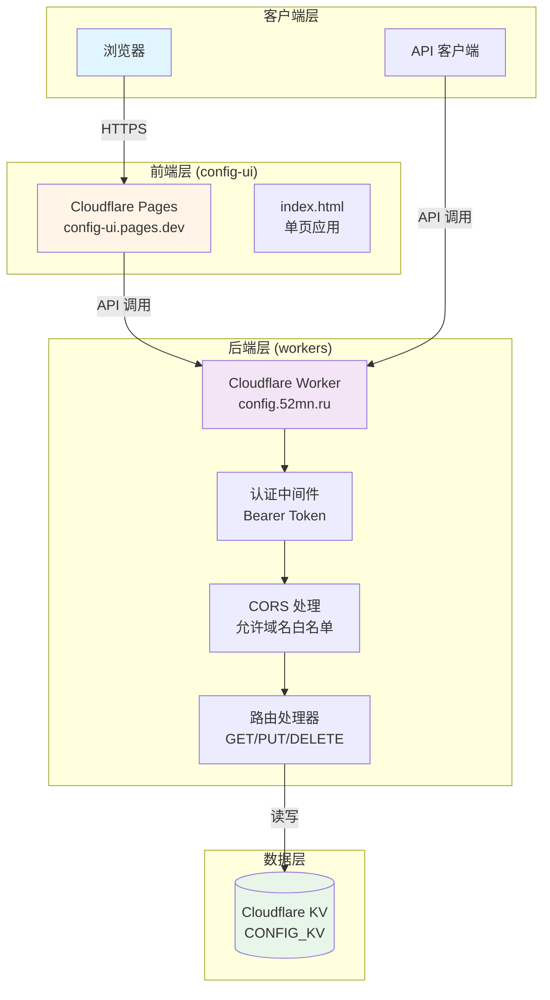

# Cloudflare Config Center

> 最后更新：2025-12-29 16:32:25

## 项目概述

基于 Cloudflare KV 数据库及 Workers 开发的配置中心，支持任意类型的值写入。提供完整的 RESTful API 用于配置的增��改查操作，并配套了一个基于 Cloudflare Pages 的前端管理界面。

## 架构图



## 技术栈

- **后端**: Cloudflare Workers (JavaScript)
- **前端**: 纯 HTML/CSS/JavaScript (无框架)
- **数据存储**: Cloudflare KV
- **部署**: Cloudflare Pages / Workers
- **认证**: Bearer Token

## 模块索引

| 模块 | 路径 | 功能 | 状态 |
|------|------|------|------|
| **Workers** | [`workers/`](./workers/CLAUDE.md) | Cloudflare Worker 后端服务 | ✅ 已索引 |
| **Config UI** | [`config-ui/`](./config-ui/CLAUDE.md) | 前端管理界面 | ✅ 已索引 |

## 核心特性

### 安全性
- ✅ Bearer Token 认证机制
- ✅ CORS 域名白名单控制
- ✅ 支持自定义域名（避免 workers.dev 被墙）

### API 接口
- `GET /config` - 获取所有配置列表
- `GET /config/{key}` - 获取单个配置
- `GET /config/{key}/value` - 获取配置的原始值
- `PUT /config/{key}` - 创建或更新配置
- `DELETE /config/{key}` - 删除配置

### 数据格式
配置值以 JSON 格式存储，支持：
```json
{
  "value": "实际配置值",
  "comment": "配置说明"
}
```

## 快速开始

### 后端部署 (Workers)
1. 创建 Cloudflare KV 数据库
2. 修改 `workers/worker.js` 中的配置：
   - `ALLOWED_ORIGINS`: 允许的前端域名
   - `AUTH_TOKEN`: 自定义强密码
3. 在 Worker 中绑定 KV 命名空间为 `CONFIG_KV`
4. 部署 Worker 并配置自定义域名

### 前端部署 (Pages)
1. 修改 `config-ui/index.html` 中的 `WORKER_URL`
2. 将 `config-ui/` 目录部署到 Cloudflare Pages
3. 默认域名：`https://config-ui.pages.dev`

## 开发指南

### 认证机制
所有 API 请求需携带 Authorization 头：
```
Authorization: Bearer YOUR_AUTH_TOKEN
```

### CORS 配置
默认允许的源（需在 worker.js 中配置）：
- `https://config-ui.pages.dev`
- `http://localhost:3000`
- `http://127.0.0.1:8080`

### 配置数据结构
支持的值类型：
- 原始字符串
- JSON 对象（自动解析）
- 布尔值（前端提供开关控件）

## 贡献指南

请遵循以下原则：
- **KISS**: 保持代码简洁
- **DRY**: 避免重复代码
- **安全性优先**: 所有操作需认证验证

## 相关文档

- [Workers 模块文档](./workers/CLAUDE.md)
- [Config UI 模块文档](./config-ui/CLAUDE.md)
- [项目 README](./readme.md)

---

*本文档由 AI 自动生成，最后初始化于 2025-12-29*
