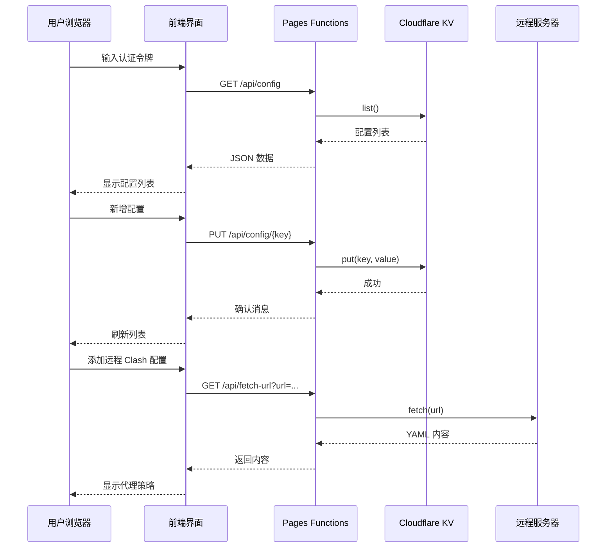

# Cloudflare 配置中心 - AI 上下文文档

> **文档生成时间**: 2025-12-31
> **项目版本**: 1.0.0
> **维护者**: AI 上下文自动生成系统

---

## 📋 项目概览

### 项目名称
**Cloudflare 配置中心** (cloudflare-config-center)

### 项目简介
这是一个基于 Cloudflare Pages 和 Cloudflare Workers 构建的配置管理系统，提供安全、高效的配置存储和访问服务。主要用于管理 Clash 代理规则和通用配置项。

### 技术栈
- **前端**: 原生 HTML5 + CSS3 + JavaScript (ES6+)
- **后端**: Cloudflare Pages Functions (运行时环境)
- **存储**: Cloudflare KV (键值存储)
- **部署平台**: Cloudflare Pages
- **安全认证**: Bearer Token

### 项目类型
- ✅ 静态网站 + Serverless 函数
- ✅ 单页应用 (SPA)
- ✅ 配置管理平台
- ✅ API 代理服务

---

## 🏗️ 项目架构

```mermaid
graph TB
    subgraph "客户端层"
        A[用户浏览器]
        B[index.html<br/>管理界面]
    end

    subgraph "Cloudflare Pages 层"
        C[Pages Router]
        D[_headers<br/>安全头配置]
        E[_redirects<br/>重定向规则]
        F[Functions<br/>API 处理]
    end

    subgraph "API 层"
        G[api/[[path]].js<br/>统一请求处理器]
    end

    subgraph "存储层"
        H[Cloudflare KV<br/>CONFIG_KV]
    end

    subgraph "外部服务"
        I[GitHub/GitLab<br/>配置文件代理]
    end

    A --> B
    B -->|HTTP Request| C
    C --> D
    C --> E
    C -->|/api/*| F
    F --> G
    G -->|CRUD| H
    G -->|代理请求| I

    style A fill:#667eea,color:#fff
    style B fill:#f97316,color:#fff
    style G fill:#10b981,color:#fff
    style H fill:#06b6d4,color:#fff
    style I fill:#8b5cf6,color:#fff
```

---

## 📁 目录结构

```
cloudflare-config-center/
│
├── index.html                 # 主应用页面（单页应用）
├── _header                    # 单文件安全头配置
├── _headers                   # 多文件安全头配置
├── _redirects                 # URL 重定向规则
├── .gitignore                 # Git 忽略规则
│
├── functions/                 # Cloudflare Pages Functions
│   └── api/
│       └── [[path]].js        # 动态路由 API 处理器
│
├── .spec-workflow/            # 规范工作流模板（开发辅助）
│   ├── templates/
│   │   ├── requirements-template.md
│   │   ├── design-template.md
│   │   ├── tasks-template.md
│   │   ├── product-template.md
│   │   ├── tech-template.md
│   │   └── structure-template.md
│   └── user-templates/
│       └── README.md
│
└── CLAUDE.md                  # 本文档（AI 上下文总入口）
```

---

## 🔑 核心功能模块

### 1️⃣ 配置管理模块
**位置**: `index.html` (前端) + `functions/api/[[path]].js` (后端)

**功能**:
- 配置项的增删改查 (CRUD)
- 支持多种配置类型：
  - `common`: 通用配置
  - `clash-yml`: Clash YAML 规则
  - `clash-github-url`: Clash 远程配置链接
- 配置注释功能
- 布尔值快捷开关

**API 端点**:
- `GET /api/config` - 获取所有配置
- `GET /api/config/{key}` - 获取单个配置
- `GET /api/config/{key}/value` - 获取配置值
- `POST /api/config/{key}` - 创建配置
- `PUT /api/config/{key}` - 更新配置
- `DELETE /api/config/{key}` - 删除配置

**数据结构**:
```json
{
  "type": "common|clash-yml|clash-github-url",
  "value": "配置值或对象",
  "comment": "配置说明"
}
```

---

### 2️⃣ Clash 规则编辑器
**位置**: `index.html` (内嵌)

**功能**:
- 可视化规则编辑
- 支持多种规则类型：
  - `DOMAIN-SUFFIX`: 域名后缀
  - `DOMAIN`: 精确域名
  - `DOMAIN-KEYWORD`: 域名关键字
  - `IP-CIDR`: IP 段
  - `GEOIP`: 国家代码
  - `SRC-IP-CIDR`: 源 IP
- 规则启用/禁用
- YAML 格式导出
- 规则排序管理

---

### 3️⃣ 代理 API 服务
**位置**: `functions/api/[[path]].js` (handleFetchUrl 函数)

**功能**:
- 代理获取远程 Clash 配置文件
- 解决 CORS 跨域问题
- URL 白名单验证
- 请求超时控制（10秒）
- 响应大小限制（5MB）

**API 端点**:
- `GET /api/fetch-url?url={encoded_url}` - 代理获取远程内容

**白名单域名**:
- `raw.githubusercontent.com`
- `github.com`
- `gitlab.com`
- `raw.githubusercontent.com.cn`
- `ghproxy.com`
- `gist.github.com`
- `raw.githubusercontentusercontent.com`

---

### 4️⃣ 认证与安全模块
**位置**: `functions/api/[[path]].js`

**认证机制**:
- Bearer Token 认证
- 所有 API 请求需要 `Authorization` 头
- Token 环境变量: `env.SECRET_TOKEN`

**CORS 配置**:
- 动态 Origin 验证
- 支持的来源：
  - `https://config-ui.pages.dev`
  - 自定义域名（需配置）
  - `http://localhost:3000`
  - `http://127.0.0.1:8080`

**安全头**:
```http
X-Frame-Options: DENY
X-Content-Type-Options: nosniff
Referrer-Policy: no-referrer
X-XSS-Protection: 1; mode=block
```

---

## 🔧 配置文件详解

### `_headers` 文件
**用途**: 定义 HTTP 响应头

**关键配置**:
- 安全响应头
- CORS 头（API 路由）
- 缓存策略（静态资源）

### `_redirects` 文件
**用途**: 定义 URL 重定向规则

**当前状态**: 基础配置，包含注释示例

### `_header` 文件
**用途**: 单文件安全头配置（简化版）

**应用范围**: 所有路由

---

## 🚀 部署配置

### Cloudflare Pages 配置要求

1. **构建命令**: 无需构建（纯静态）
2. **构建输出**: 根目录
3. **环境变量**:
   - `SECRET_TOKEN`: 认证密钥（必填）
   - `CONFIG_KV`: KV 命名空间绑定（必填）

### KV 命名空间绑定
```javascript
// 在 Cloudflare Pages 设置中绑定
Variable: CONFIG_KV
KV Namespace: your-kv-namespace
```

---

## 🎯 开发指南

### 本地开发
使用 `wrangler pages dev` 进行本地测试：

```bash
# 安装 wrangler
npm install -g wrangler

# 启动开发服务器
wrangler pages dev --kv CONFIG_KV

# 设置环境变量
wrangler pages dev --kv CONFIG_KV --binding SECRET_TOKEN=your_token
```

### API 测试示例

```bash
# 获取所有配置
curl -H "Authorization: Bearer YOUR_TOKEN" \
  https://your-domain.pages.dev/api/config

# 创建配置
curl -X PUT \
  -H "Authorization: Bearer YOUR_TOKEN" \
  -H "Content-Type: application/json" \
  -d '{"type":"common","value":"test","comment":"测试"}' \
  https://your-domain.pages.dev/api/config/my-key

# 代理获取远程文件
curl "https://your-domain.pages.dev/api/fetch-url?url=https://raw.githubusercontent.com/user/config.yaml" \
  -H "Authorization: Bearer YOUR_TOKEN"
```

---

## 📊 数据流图



---

## 🔍 模块导航

| 模块名称 | 文档位置 | 职责描述 |
|---------|---------|---------|
| 前端应用 | [modules/frontend.md](modules/frontend.md) | 用户界面与交互逻辑 |
| API 服务 | [modules/api.md](modules/api.md) | 后端接口处理与业务逻辑 |
| 安全认证 | [modules/security.md](modules/security.md) | 认证、CORS、安全头配置 |
| 配置规范 | [modules/configuration.md](modules/configuration.md) | 环境变量、KV 绑定、部署配置 |

---

## 🛠️ 技术决策记录

### 为什么选择 Cloudflare Pages Functions？
- ✅ 无需单独部署 Workers
- ✅ 边缘计算，全球分发
- ✅ 与 KV 存储无缝集成
- ✅ 免费额度充足

### 为什么使用单页应用？
- ✅ 快速响应用户操作
- ✅ 减少服务器负载
- ✅ 离线友好（可扩展 PWA）
- ✅ 部署简单（单一 HTML 文件）

### 为什么设计三种配置类型？
- `common`: 灵活的通用配置存储
- `clash-yml`: 针对 Clash 规则优化的编辑体验
- `clash-github-url`: 支持远程配置动态加载

---

## 📈 性能优化建议

### 前端优化
- [ ] 实现配置项虚拟滚动（大量配置时）
- [ ] 添加本地缓存（IndexedDB）
- [ ] 优化首次加载（代码分割）

### 后端优化
- [ ] 实现 KV 缓存策略
- [ ] 添加请求限流（Rate Limiting）
- [ ] 实现 ETag 支持

---

## 🔐 安全注意事项

### ⚠️ 重要提醒
1. **SECRET_TOKEN** 必须使用强随机字符串
2. **ALLOWED_ORIGINS** 必须限制为可信域名
3. **API 代理白名单** 严格控制允许访问的域名
4. **HTTPS** 强制启用（生产环境）
5. **KV 数据** 建议启用加密（敏感信息）

---

## 📝 开发规范

### 代码风格
- JavaScript: ES6+ 语法
- 函数命名：驼峰式（camelCase）
- 常量命名：全大写下划线（UPPER_SNAKE_CASE）
- 注释：JSDoc 风格

### 提交规范
遵循 Conventional Commits：
- `feat:` 新功能
- `fix:` 修复问题
- `docs:` 文档更新
- `refactor:` 代码重构
- `style:` 代码格式
- `test:` 测试相关
- `chore:` 构建/工具

---

## 🎓 学习资源

- [Cloudflare Pages 文档](https://developers.cloudflare.com/pages/)
- [Pages Functions 文档](https://developers.cloudflare.com/pages/functions/)
- [Cloudflare KV 文档](https://developers.cloudflare.com/kv/)
- [Clash 配置教程](https://lancellc.gitbook.io/clash/)

---

## 📞 支持与反馈

如遇到问题或需要帮助，请：
1. 检查本文档的相关章节
2. 查看模块文档的详细说明
3. 提交 Issue 到项目仓库

---

**文档版本**: 1.0.0
**最后更新**: 2025-12-31
**维护状态**: ✅ 活跃维护
