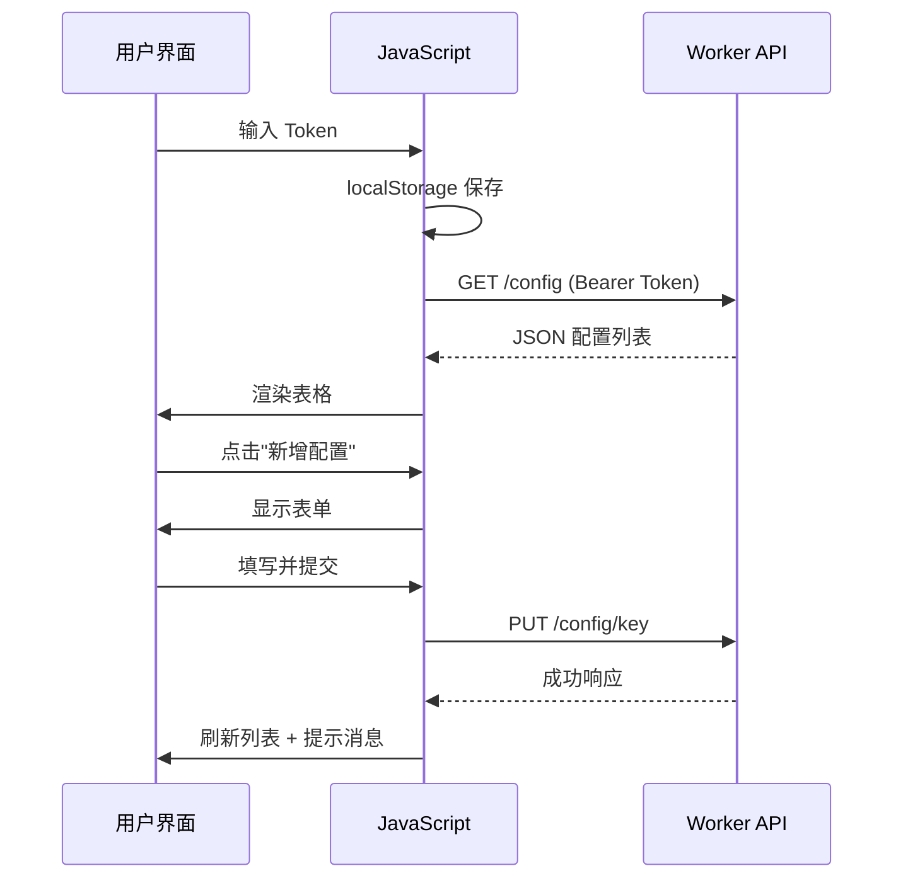

# Config UI 模块

> [🏠 返回根目录](../CLAUDE.md) > Config UI 模块

## 模块概述

基于 Cloudflare Pages 部署的前端管理界面，提供可视化的配置管理功能。

## 文件结构

```
config-ui/
├── index.html      # 单页应用（~525 行）
├── _header         # 自定义响应头配置
├── readme.md       # 部署说明
└── CLAUDE.md       # 本文档
```

## 核心功能

### 1. 认证管理
- **位置**: `index.html:202-204`
- **功能**: Bearer Token 输入与本地存储
- **持久化**: 使用 localStorage 保存 Token

### 2. 配置列表展示
- **位置**: `index.html:372-442`
- **功能**:
  - 按键名排序显示
  - 支持值和注释的展示
  - 布尔值特殊显示为开关控件
  - JSON 值自动格式化

### 3. CRUD 操作

| 操作 | 函数 | 位置 |
|------|------|------|
| 读取列表 | `fetchConfigList()` | `index.html:347-365` |
| 创建配置 | 表单提交 | `index.html:297-307` |
| 编辑配置 | `editConfig()` | `index.html:491-501` |
| 删除配置 | `deleteConfig()` | `index.html:474-482` |
| 更新配置 | `updateConfig()` | `index.html:449-456` |

### 4. 特殊功能

#### 布尔值开关
- **位置**: `index.html:464-472`
- **功能**: `true`/`false` 值显示为滑动开关
- **实时更新**: 点击开关直接更新配置

#### JSON 格式化显示
- **位置**: `index.html:415-422`
- **功能**: 自动检测并格式化 JSON 值
- **降级**: 非 JSON 显示为普通文本

## UI 组件

### 表单区域
```html
<!-- index.html:213-233 -->
<form id="configForm">
  - 配置键 (Key) - 必填
  - 配置值 (Value) - 必填，多行文本框
  - 注释 (Comment) - 可选
</form>
```

### 操作按钮
- **新增配置**: 显示空白表单
- **编辑**: 加载现有配置到表单（键不可修改）
- **删除**: 二次确认后删除

### 消息提示
- **位置**: `index.html:508-513`
- **类型**: success / error
- **自动消失**: 4 秒后隐藏

## 配置项

### API 端点
```javascript
// index.html:251
const WORKER_URL = 'https://config.52mn.ru/config';
```

### 请求流程


## 样式系统

### CSS 变量
```css
:root {
  --primary-color: #007bff;
  --danger-color: #dc3545;
  --success-color: #28a745;
  --light-gray: #f8f9fa;
  --border-color: #dee2e6;
}
```

### 响应式设计
- 容器最大宽度: 960px
- 表格自适应布局
- 移动端友好

## 部署步骤

1. 修改 `index.html` 中的 `WORKER_URL`
2. 将整个 `config-ui/` 目录部署到 Cloudflare Pages
3. 访问部署后的域名（如 `https://config-ui.pages.dev`）

## 安全特性

- ✅ Token 本地存储（不暴露在 URL 中）
- ✅ 所有请求包含 Authorization 头
- ✅ XSS 防护：`escapeHtml()` 函数
- ✅ 模板字符串转义：`escapeForTemplateLiteral()`

## 辅助函数

| 函数 | 功能 | 位置 |
|------|------|------|
| `makeRequest()` | 统一 API 请求处理 | `index.html:317-345` |
| `renderConfigList()` | 渲染配置表格 | `index.html:372-442` |
| `showMessage()` | 显示操作反馈 | `index.html:508-513` |
| `escapeHtml()` | HTML 实体转义 | `index.html:515-517` |
| `escapeForTemplateLiteral()` | 模板字符串转义 | `index.html:520-522` |

## 注意事项

- ⚠️ 首次访问需输入认证 Token
- ⚠️ Worker URL 需在部署前修改
- ⚠️ 建议配置自定义域名（避免 workers.dev 被墙）
- ✅ 支持直接重新上传更新页面

## 相关文档

- [主项目文档](../CLAUDE.md)
- [Workers 后端文档](../workers/CLAUDE.md)
- [配置中心 API 文档](../readme.md)

---

*模块文档最后更新：2025-12-29*
