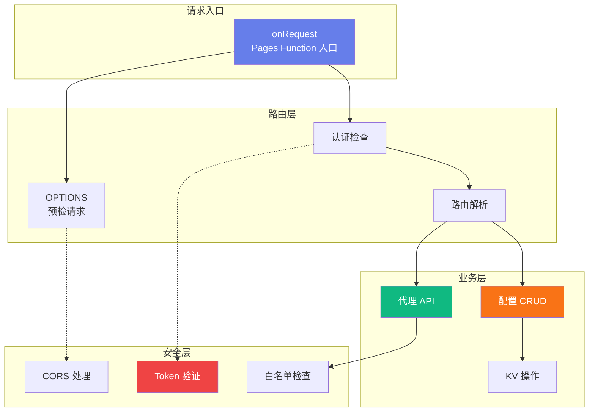
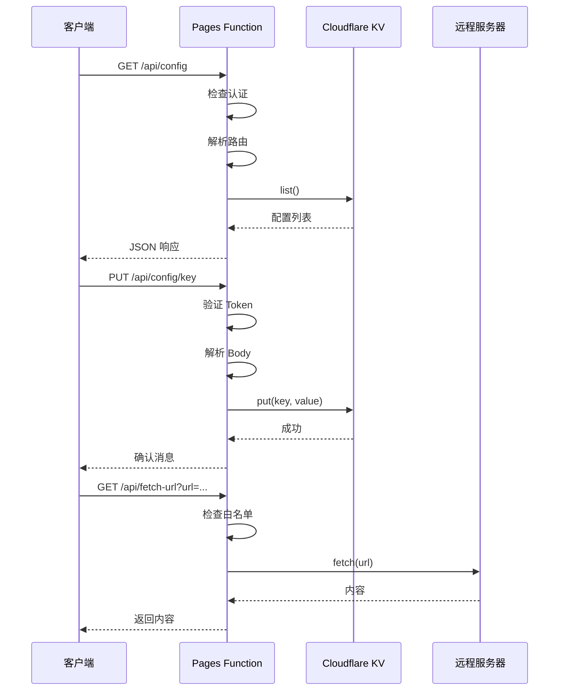

# API 服务模块

> **父级文档**: [CLAUDE.md](../CLAUDE.md)
> **模块位置**: `functions/api/[[path]].js`
> **最后更新**: 2025-12-31

---

## 📍 模块导航

**面包屑**: 首页 / 模块文档 / API 服务模块

---

## 📋 模块概述

### 职责描述
处理所有 HTTP 请求，提供配置管理、远程代理、认证授权等功能。采用 Cloudflare Pages Functions 的动态路由 `[[path]]` 实现统一入口。

### 技术栈
- **运行时**: Cloudflare Pages Functions (基于 Workers)
- **存储**: Cloudflare KV
- **认证**: Bearer Token
- **协议**: HTTP/1.1, HTTP/2

### 核心特性
- ✅ 动态路由（统一入口）
- ✅ RESTful API 设计
- ✅ CORS 跨域支持
- ✅ 请求认证与授权
- ✅ 错误处理与日志
- ✅ URL 白名单验证

---

## 🏗️ 架构设计



---

## 🔌 API 端点

### 配置管理 API

#### 1. 获取所有配置
```http
GET /api/config
Authorization: Bearer {SECRET_TOKEN}
```

**响应**:
```json
[
  {
    "key": "my-config",
    "value": {
      "type": "common",
      "value": "config-value",
      "comment": "配置说明"
    }
  }
]
```

---

#### 2. 获取单个配置
```http
GET /api/config/{key}
Authorization: Bearer {SECRET_TOKEN}
```

**响应**:
```json
{
  "type": "common",
  "value": "config-value",
  "comment": "配置说明"
}
```

---

#### 3. 获取配置值（纯文本）
```http
GET /api/config/{key}/value
Authorization: Bearer {SECRET_TOKEN}
```

**响应**:
```
config-value
```
**Content-Type**: `text/plain`

---

#### 4. 创建/更新配置
```http
PUT /api/config/{key}
Authorization: Bearer {SECRET_TOKEN}
Content-Type: application/json

{
  "type": "common",
  "value": "config-value",
  "comment": "配置说明"
}
```

**响应**:
```
Config 'my-config' updated successfully
```

---

#### 5. 删除配置
```http
DELETE /api/config/{key}
Authorization: Bearer {SECRET_TOKEN}
```

**响应**:
```
Config 'my-config' deleted successfully
```

---

### 代理 API

#### 获取远程内容
```http
GET /api/fetch-url?url={encoded_url}
Authorization: Bearer {SECRET_TOKEN}
```

**查询参数**:
- `url`: 要获取的远程 URL（必须 URL 编码）

**白名单域名**:
- `raw.githubusercontent.com`
- `github.com`
- `gitlab.com`
- `raw.githubusercontent.com.cn`
- `ghproxy.com`
- `gist.github.com`
- `raw.githubusercontentusercontent.com`

**响应**:
- **状态码 200**: 返回远程内容（text/plain）
- **状态码 400**: 缺少 URL 参数或格式错误
- **状态码 403**: 域名不在白名单中
- **状态码 504**: 请求超时（10秒）
- **状态码 413**: 响应过大（超过 5MB）

---

### 预检请求（OPTIONS）

```http
OPTIONS /api/*
```

**响应头**:
```http
Access-Control-Allow-Origin: {request-origin}
Access-Control-Allow-Methods: GET, POST, PUT, DELETE, OPTIONS
Access-Control-Allow-Headers: Content-Type, Authorization
Access-Control-Max-Age: 86400
```

---

## 🔐 认证与授权

### 认证机制
```javascript
function isAuthenticated(env, request) {
  const authHeader = request.headers.get('Authorization');
  return authHeader === `Bearer ${env.SECRET_TOKEN}`;
}
```

### 环境变量
- `SECRET_TOKEN`: 认证密钥（必填）
- `CONFIG_KV`: KV 命名空间绑定（必填）

### CORS 配置

#### 允许的来源（ALLOWED_ORIGINS）
```javascript
const ALLOWED_ORIGINS = [
  'https://config-ui.pages.dev',
  'https://config-ui.xx.xx.com',  // 自定义域名
  'http://localhost:3000',
  'http://127.0.0.1:8080'
];
```

#### CORS 响应头生成
```javascript
function getCorsHeaders(requestOrigin) {
  const headers = new Headers();
  if (requestOrigin && ALLOWED_ORIGINS.includes(requestOrigin)) {
    headers.set('Access-Control-Allow-Origin', requestOrigin);
    headers.set('Access-Control-Allow-Methods', 'GET, POST, PUT, DELETE, OPTIONS');
    headers.set('Access-Control-Allow-Headers', 'Content-Type, Authorization');
    headers.set('Access-Control-Allow-Credentials', 'true');
  }
  return headers;
}
```

---

## 💾 KV 操作

### 获取配置
```javascript
async function getRawAndParsedConfig(kvNamespace, key) {
  const rawValue = await kvNamespace.get(key);
  let parsedValue = null;

  if (rawValue !== null) {
    try {
      parsedValue = JSON.parse(rawValue);
    } catch (e) {
      // 不是有效的 JSON，parsedValue 保持为 null
    }
  }

  return { rawValue, parsedValue };
}
```

### 保存配置
```javascript
async function putConfig(kvNamespace, key, value) {
  await kvNamespace.put(key, value);
}
```

### 删除配置
```javascript
async function deleteConfig(kvNamespace, key) {
  await kvNamespace.delete(key);
}
```

### 列出所有配置
```javascript
const list = await env.CONFIG_KV.list();
for (const key of list.keys) {
  const { rawValue, parsedValue } = await getRawAndParsedConfig(env.CONFIG_KV, key.name);
  // 处理配置项
}
```

---

## 🌐 代理功能

### URL 白名单验证
```javascript
const allowedDomains = [
  'raw.githubusercontent.com',
  'github.com',
  'gitlab.com',
  'raw.githubusercontent.com.cn',
  'ghproxy.com',
  'gist.github.com',
  'raw.githubusercontentusercontent.com'
];

const parsedUrl = new URL(targetUrl);
if (!allowedDomains.includes(parsedUrl.hostname)) {
  return createResponse(requestOrigin,
    `Domain not allowed: ${parsedUrl.hostname}`,
    403);
}
```

### 超时控制
```javascript
const controller = new AbortController();
const timeoutId = setTimeout(() => controller.abort(), 10000); // 10秒超时

const response = await fetch(targetUrl, {
  signal: controller.signal,
  headers: {
    'User-Agent': 'Clash-Config-Center/1.0'
  }
});

clearTimeout(timeoutId);
```

### 大小限制
```javascript
const text = await response.text();

// 限制响应大小（最大 5MB）
if (text.length > 5 * 1024 * 1024) {
  return createResponse(requestOrigin, 'Response too large (max 5MB)', 413);
}
```

---

## 🛡️ 错误处理

### 标准错误响应
```javascript
function createResponse(requestOrigin, body, status, contentType = 'text/plain') {
  const headers = getCorsHeaders(requestOrigin);
  headers.set('Content-Type', contentType);
  return new Response(body, { status, headers });
}
```

### 常见错误码

| 状态码 | 说明 | 示例 |
|-------|------|------|
| 200 | 成功 | 配置已更新 |
| 204 | 预检请求成功 | OPTIONS 请求 |
| 400 | 请求参数错误 | 缺少 URL 参数 |
| 401 | 未授权 | Token 无效 |
| 403 | 禁止访问 | 域名不在白名单 |
| 404 | 资源不存在 | 配置键不存在 |
| 405 | 方法不允许 | 不支持的 HTTP 方法 |
| 413 | 请求过大 | 响应超过 5MB |
| 500 | 服务器错误 | 内部错误 |
| 504 | 网关超时 | 远程请求超时 |

---

## 🔄 请求处理流程



---

## 📊 性能优化

### 当前实现
- ✅ KV 异步读取
- ✅ 请求超时控制
- ✅ 响应大小限制

### 优化建议
- [ ] 实现 KV 缓存策略
- [ ] 添加请求限流（Rate Limiting）
- [ ] 实现 ETag 支持（304 响应）
- [ ] 使用 Durable Objects（如果需要状态管理）

---

## 🐛 调试指南

### 本地测试
```bash
# 使用 wrangler 本地开发
wrangler pages dev --kv CONFIG_KV --binding SECRET_TOKEN=your_token

# 测试 API 端点
curl http://localhost:8788/api/config \
  -H "Authorization: Bearer your_token"
```

### 日志输出
```javascript
console.error('Worker error:', error);
```

查看日志：
1. 进入 Cloudflare Dashboard
2. 选择 Pages 项目
3. 查看 Functions 日志

---

## 🔒 安全最佳实践

### 1. Token 管理
```javascript
// ❌ 错误：硬编码 Token
const token = 'my-secret-token';

// ✅ 正确：使用环境变量
const token = env.SECRET_TOKEN;
```

### 2. 输入验证
```javascript
// ❌ 错误：直接使用用户输入
fetch(userInput);

// ✅ 正确：验证白名单
if (allowedDomains.includes(parsedUrl.hostname)) {
  fetch(userInput);
}
```

### 3. 错误信息
```javascript
// ❌ 错误：泄露敏感信息
return new Error(`Database error: ${err.message}`);

// ✅ 正确：通用错误信息
return new Error('Internal Server Error');
```

---

## 📚 相关资源

- [Cloudflare Pages Functions 文档](https://developers.cloudflare.com/pages/functions/)
- [Cloudflare Workers API 参考](https://developers.cloudflare.com/workers/runtime-apis/)
- [KV 存储文档](https://developers.cloudflare.com/kv/)

---

## 🎯 版本历史

### v1.0.0 (2025-12-31)
- ✅ 初始版本
- ✅ 配置 CRUD API
- ✅ 代理 API
- ✅ 认证与 CORS

---

**模块维护者**: 后端团队
**文档版本**: 1.0.0
**最后审核**: 2025-12-31
