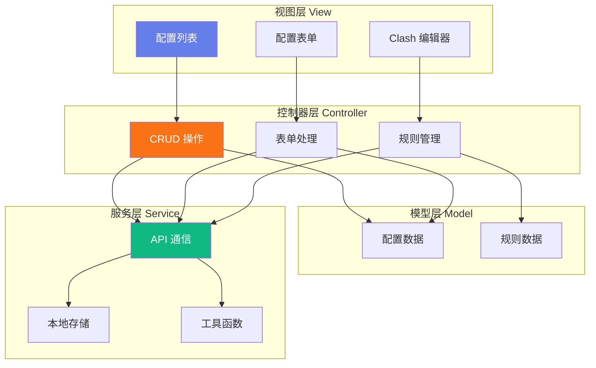

# 前端应用模块

> **父级文档**: [CLAUDE.md](../CLAUDE.md)
> **模块位置**: `index.html`
> **最后更新**: 2025-12-31

---

## 📍 模块导航

**面包屑**: 首页 / 模块文档 / 前端应用模块

---

## 📋 模块概述

### 职责描述
负责用户界面的展示、用户交互处理、以及与后端 API 的通信。采用单页应用（SPA）架构，所有逻辑封装在单个 HTML 文件中。

### 技术栈
- **HTML5**: 语���化结构
- **CSS3**: 现代化样式（CSS 变量、Flexbox、Grid）
- **JavaScript (ES6+)**: 原生 JavaScript，无框架依赖

### 核心特性
- ✅ 响应式设计（移动端适配）
- ✅ 现代化 UI（渐变、阴影、动画）
- ✅ 本地存储（Token 持久化）
- ✅ 实时反馈（消息提示、加载状态）
- ✅ 类型化配置管理

---

## 🏗️ 架构设计



---

## 🎨 UI 组件库

### 1. 容器组件

#### `.container`
主容器，居中布局，圆角卡片设计。

```css
max-width: 1200px;
margin: 0 auto;
padding: 2rem;
background: var(--bg-primary);
border-radius: var(--radius-lg);
box-shadow: var(--shadow-xl);
```

#### `.form-section`
表单分组容器，悬停效果。

```css
background: var(--bg-secondary);
border: 1px solid var(--border-color);
border-radius: var(--radius-md);
padding: 1.5rem;
margin-bottom: 1.5rem;
transition: box-shadow 0.2s;
```

---

### 2. 表单组件

#### 输入框
统一样式的文本输入框、密码框、文本域。

```html
<input type="text" id="configKey" required>
<textarea id="configValue" rows="5" required></textarea>
```

**特性**:
- 聚焦时边框高亮
- 阴影扩散动画
- 自动验证

#### 下拉选择框
带自定义箭头的原生 select。

```css
appearance: none;
background-image: url("data:image/svg+xml,...");
background-repeat: no-repeat;
background-position: right 1rem center;
```

#### 滑动开关（Toggle Switch）
布尔值专用开关组件。

```html
<label class="toggle-switch">
  <input type="checkbox">
  <span class="slider"></span>
</label>
```

---

### 3. 按钮组件

#### `.btn` - 基础按钮
```css
padding: 0.75rem 1.5rem;
border: none;
border-radius: var(--radius-sm);
font-weight: 600;
cursor: pointer;
transition: all 0.2s;
```

#### 变体
- `.btn-primary`: 主要操作（橙色渐变）
- `.btn-secondary`: 次要操作（灰色）
- `.btn-danger`: 危险操作（红色）
- `.btn-sm`: 小尺寸按钮

---

### 4. 消息提示组件

#### `.message-box`
全局消息提示框。

**类型**:
- `.success`: 成功提示（绿色）
- `.error`: 错误提示（红色）
- `.info`: 信息提示（蓝色）

**动画**: 滑入淡出（slideDown + fade）

---

### 5. 类型标签

#### `.type-badge`
配置类型徽章。

**变体**:
- `.type-common`: 通用配置（灰色）
- `.type-clash-yml`: Clash YAML（黄色）
- `.type-clash-github-url`: 远程链接（蓝色）

---

## 🔧 核心功能

### 1. 配置管理

#### 获取配置列表
```javascript
async function fetchConfigList() {
  const responseText = await makeRequest('GET');
  const configs = JSON.parse(responseText);
  renderConfigList(configs);
}
```

#### 创建/更新配置
```javascript
async function updateConfig(key, payload) {
  const result = await makeRequest('PUT', key, payload);
  if (result !== null) {
    showMessage(`配置 '${key}' 已成功保存。`, 'success');
    fetchConfigList();
  }
}
```

#### 删除配置
```javascript
async function deleteConfig(key) {
  if (confirm(`确定要删除配置 '${key}' 吗？`)) {
    await makeRequest('DELETE', key);
    showMessage(`配置 '${key}' 已删除。`, 'success');
    fetchConfigList();
  }
}
```

---

### 2. Clash 规则编辑器

#### 数据结构
```javascript
let clashRules = [
  {
    type: 'DOMAIN-SUFFIX',
    value: 'google.com',
    policy: 'Proxy',
    enabled: true
  }
];
```

#### 添加规则
```javascript
function addRule() {
  const ruleType = document.getElementById('ruleType').value;
  const ruleValue = document.getElementById('ruleValue').value.trim();
  const rulePolicy = document.getElementById('rulePolicy').value;

  clashRules.push({
    type: ruleType,
    value: ruleValue,
    policy: rulePolicy,
    enabled: true
  });

  renderRulesList();
}
```

#### 导出 YAML
```javascript
function exportRulesAsYAML() {
  const yaml = clashRules
    .filter(r => r.enabled)
    .map(r => `  - ${r.type},${r.value},${r.policy}`)
    .join('\n');

  navigator.clipboard.writeText('rules:\n' + yaml);
}
```

---

### 3. API 代理功能

#### 获取远程 YAML
```javascript
async function fetchRemoteYAML(urlString) {
  const encodedUrl = encodeURIComponent(urlString);
  const apiUrl = `${WORKER_URL}/../api/fetch-url?url=${encodedUrl}`;

  const response = await fetch(apiUrl, {
    headers: {
      'Authorization': `Bearer ${token}`
    }
  });

  return await response.text();
}
```

#### 提取代理策略
```javascript
function extractProxyGroups(yamlText) {
  const policies = [];
  const lines = yamlText.split('\n');
  let inProxyGroups = false;

  for (const line of lines) {
    if (line.trim().startsWith('proxy-groups:')) {
      inProxyGroups = true;
      continue;
    }

    if (inProxyGroups && line.match(/^\S[\w-]+:/)) {
      break;
    }

    const nameMatch = line.match(/^\s*-\s*name:\s*(.+)$/);
    if (nameMatch) {
      policies.push(nameMatch[1].trim());
    }
  }

  return policies;
}
```

---

## 🎨 样式系统

### CSS 变量（Design Tokens）

#### 主色调
```css
--primary-color: #f97316;
--primary-hover: #ea580c;
--primary-light: #ffedd5;
```

#### 功能色
```css
--success-color: #10b981;
--danger-color: #ef4444;
--warning-color: #f59e0b;
--info-color: #06b6d4;
```

#### 中性色
```css
--bg-primary: #ffffff;
--bg-secondary: #f8fafc;
--text-primary: #0f172a;
--text-secondary: #475569;
```

---

## 📱 响应式设计

### 断点
- **移动端**: `< 768px`
- **桌面端**: `>= 768px`

### 移动端优化
```css
@media (max-width: 768px) {
  .container {
    padding: 1rem;
    margin: 0;
    border-radius: 0;
  }

  .action-bar {
    flex-direction: column;
    align-items: stretch;
  }

  table {
    font-size: 0.875rem;
  }
}
```

---

## 🔐 安全措施

### 1. Token 存储
```javascript
// 使用 localStorage 持久化
localStorage.setItem('configAuthToken', token);

// 自动填充
const savedToken = localStorage.getItem('configAuthToken');
if (savedToken) {
  authTokenInput.value = savedToken;
}
```

### 2. XSS 防护
```javascript
function escapeHtml(unsafe) {
  return unsafe
    .replace(/&/g, "&amp;")
    .replace(/</g, "&lt;")
    .replace(/>/g, "&gt;")
    .replace(/"/g, "&quot;")
    .replace(/'/g, "&#039;");
}
```

### 3. 模板字符串转义
```javascript
function escapeForTemplateLiteral(str) {
  return String(str)
    .replace(/`/g, '\\`')
    .replace(/\$/g, '\\$');
}
```

---

## 🚀 性能优化

### 当前实现
- ✅ 事件委托（减少监听器数量）
- ✅ 防抖/节流（消息提示自动消失）
- ✅ 最小化 DOM 操作

### 优化建议
- [ ] 实现虚拟滚动（大量配置项）
- [ ] 添加 Web Worker 处理 YAML 解析
- [ ] 使用 IndexedDB 缓存配置
- [ ] 实现代码分割（按需加载）

---

## 🐛 已知问题

### 1. 大文件处理
- **问题**: YAML 解析在主线程执行，可能阻塞 UI
- **解决方案**: 使用 Web Worker

### 2. 移动端滚动
- **问题**: 某些固定元素在移动端滚动时可能遮挡内容
- **解决方案**: 使用 `position: sticky`

---

## 📊 代码统计

| 指标 | 数值 |
|-----|------|
| 总行数 | ~1297 行 |
| HTML | ~200 行 |
| CSS | ~480 行 |
| JavaScript | ~617 行 |
| 函数数量 | ~30 个 |

---

## 🎯 开发指南

### 添加新功能
1. 在 `index.html` 中添加 UI 组件
2. 实现事件监听器
3. 调用 API 服务函数
4. 更新状态并刷新界面

### 修改样式
1. 更新 CSS 变量（优先）
2. 修改组件样式
3. 测试响应式布局

### 调试技巧
```javascript
// 开启调试模式
console.log('Config List:', configs);
console.error('API Error:', error);

// 查看网络请求
// 使用浏览器 DevTools Network 面板
```

---

## 📚 相关资源

- [MDN Web API 文档](https://developer.mozilla.org/)
- [CSS Tricks Flexbox 指南](https://css-tricks.com/snippets/css/a-guide-to-flexbox/)
- [JavaScript ES6+ 特性](https://es6-features.org/)

---

**模块维护者**: 前端团队
**文档版本**: 1.0.0
**最后审核**: 2025-12-31
