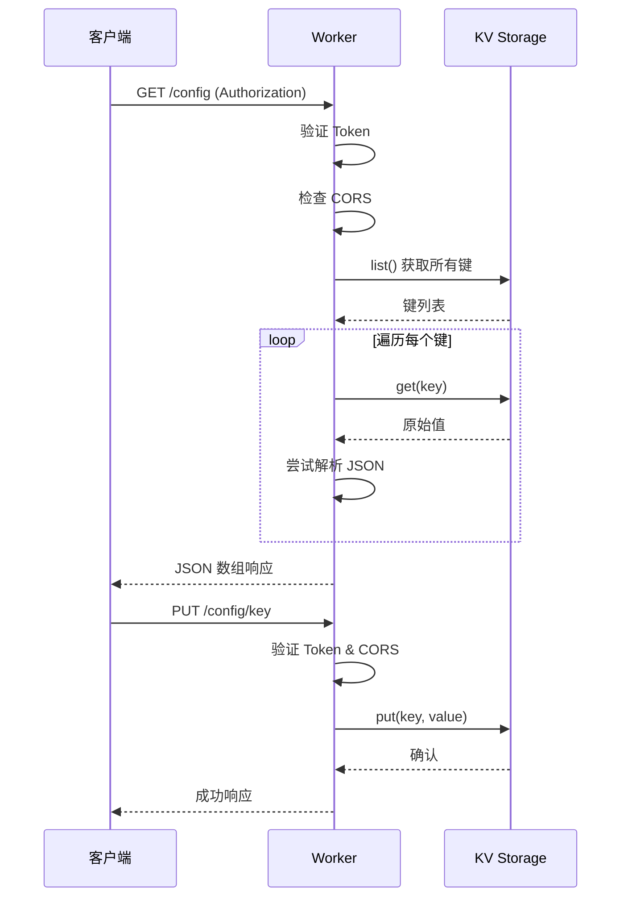

# Workers 模块

> [🏠 返回根目录](../CLAUDE.md) > Workers 模块

## 模块概述

Cloudflare Worker 后端服务，提供配置管理的 RESTful API。

## 文件结构

```
workers/
├── worker.js      # Worker 入口文件（~200 行）
├── readme.md      # 部署配置说明
└── CLAUDE.md      # 本文档
```

## 核心功能

### 1. 认证机制
- **位置**: `worker.js:60-63`
- **方式**: Bearer Token 验证
- **配置**: `AUTH_TOKEN` 常量（需自定义）

### 2. CORS 处理
- **位置**: `worker.js:17-51`
- **功能**: 动态 CORS 头生成
- **白名单**: `ALLOWED_ORIGINS` 数组配置

### 3. API 路由

| 方法 | 路径 | 功能 | 代码位置 |
|------|------|------|----------|
| GET | `/config` | 获取所有配置 | `worker.js:166-174` |
| GET | `/config/{key}` | 获取单个配置 | `worker.js:139-164` |
| GET | `/config/{key}/value` | 获取原始值 | `worker.js:146-154` |
| PUT | `/config/{key}` | 创建/更新配置 | `worker.js:176-181` |
| DELETE | `/config/{key}` | 删除配置 | `worker.js:183-186` |

### 4. KV 操作

#### 读取配置
- **函数**: `getRawAndParsedConfig()`
- **位置**: `worker.js:73-84`
- **返回**: 原始值 + 解析后的 JSON 对象

#### 写入配置
- **函数**: `putConfig()`
- **位置**: `worker.js:93-95`
- **参数**: KV 命名空间、键、值

#### 删除配置
- **函数**: `deleteConfig()`
- **位置**: `worker.js:103-105`
- **参数**: KV 命名空间、键

## 配置项

### 必需配置
```javascript
// worker.js:2-8
const ALLOWED_ORIGINS = [
  'https://config-ui.pages.dev', // 替换为实际域名
  'http://localhost:3000',
  'http://127.0.0.1:8080',
  'http://1.1.1.1'              // 特定 IP
];

const AUTH_TOKEN = '8ti2zSqm6Hna7xf4jUh7pcWc'; // 强密码
```

### KV 绑定
- 绑定名称: `CONFIG_KV`
- 在 Cloudflare Workers 控制台配置

## 数据流



## 错误处理

| 状态码 | 场景 | 位置 |
|--------|------|------|
| 401 | 未认证/Token 无效 | `worker.js:122` |
| 404 | 配置不存在 | `worker.js:143` |
| 405 | 不支持的 HTTP 方法 | `worker.js:189` |
| 500 | 服务器内部错误 | `worker.js:193` |

## 部署步骤

1. 创建 KV 数据库
2. 修改 `worker.js` 头部配置
3. 添加 KV 绑定（名称：`CONFIG_KV`）
4. 部署 Worker
5. 配置自定义域名（workers.dev 域名被墙）

## 注意事项

- ✅ 所有请求必须包含 `Authorization: Bearer {TOKEN}`
- ✅ CORS 预检请求自动处理（缓存 24 小时）
- ✅ 支持 JSON 和纯文本值存储
- ⚠️ 生产环境需更换 `AUTH_TOKEN`

## 相关文档

- [主项目文档](../CLAUDE.md)
- [配置中心 API 文档](../readme.md)
- [前端模块文档](../config-ui/CLAUDE.md)

---

*模块文档最后更新：2025-12-29*
